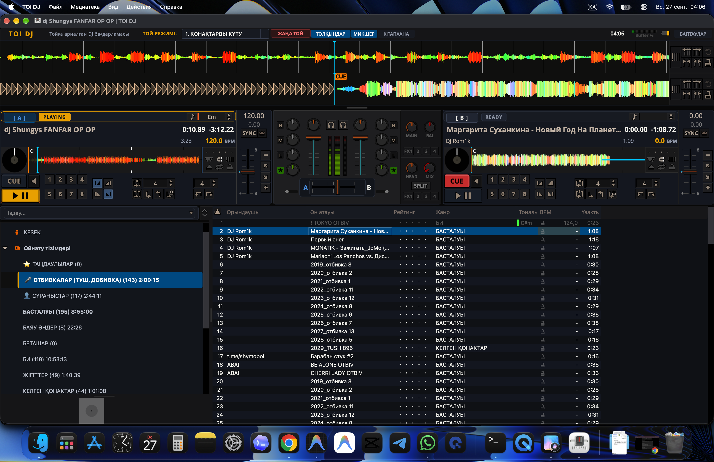

# 🎧 TOI DJ — Қазақ тойлары мен іс-шараларына арналған диджей бағдарламасы
### Professional Event & Wedding DJ Software for macOS, Windows & Linux

<p align="center">
  
</p>

<p align="center">
  <a href="https://azamaperdeev05.github.io/toi-dj/"></a>
  <a href="https://github.com/Azamaperdeev05/toi-dj/releases/latest"></a>
  <a href="#"></a>
  <a href="#"></a>
  <a href="#"></a>
  <a href="#"></a>
  <a href="LICENSE"></a>
  <a href="#"></a>
</p>

---

## 🌐 Ресми Таныстыру Сайты (Official Apple-Style Website)

Бағдарламаның мүмкіндіктерін интерактивті режимде көру үшін ресми сайтқа өтіңіз:  
👉 **[https://azamaperdeev05.github.io/toi-dj/](https://azamaperdeev05.github.io/toi-dj/)**

---

## 📥 Жүктеп алу (Download TOI DJ)

### 🍏 macOS (Apple Silicon M1 / M2 / M3 / M4 & Intel)
| Файл | Түрі | Өлшемі | Архитектура |
| :--- | :--- | :--- | :--- |
| [**TOI-DJ-1.1.0-macOS-arm64.dmg**](https://github.com/Azamaperdeev05/toi-dj/releases/latest/download/TOI-DJ-1.1.0-macOS-arm64.dmg) | macOS DMG Орнатушы | ~124 MB | Apple Silicon (`arm64`) |
| [**TOI-DJ-1.1.0-macOS-arm64.zip**](https://github.com/Azamaperdeev05/toi-dj/releases/latest/download/TOI-DJ-1.1.0-macOS-arm64.zip) | ZIP Мұрағат | ~100 MB | Apple Silicon (`arm64`) |

> 💡 **macOS Талаптары:** macOS 11.0 (Big Sur) бастап macOS 15 (Sequoia) дейінгі барлық нұсқалар.

### 🪟 Windows (10 / 11 64-bit) & 🐧 Linux (AppImage)
GitHub Actions CI/CD арқылы әрбір жаңа релиз үшін автоматты түрде жиналады немесе төмендегі бастапқы код арқылы 1 пәрменмен жинауға болады:  
👉 [Релиздер бөліміне өту](https://github.com/Azamaperdeev05/toi-dj/releases)

---

## 🎯 TOI DJ v1.1.0 Жаңалықтары (What's New)

1. ⏸️ **Spacebar (Пробел) әмбебап паузасы:**
   - Той кезінде тамада сөйлегенде — `Space` басқанда ойнап тұрған дек бірден тоқтайды. Қайта бассаңыз — сол сәттен жалғасады.
   - Іздеу (Search) жолында жазып жатқан кезде әдеттегідей бос орын таңбасын қояды.
2. 🧹 **Кристалды таза кітапхана:**
   - Диджейді алаңдататын артық техникалық бағандар (Рейтинг, Жанр, Тональ/Key, BPM) жасырылды. Тек қажетті мәліметтер ғана көрінеді.
3. 🎤 **80+ Сахналық Отбивкалар мен Тұштар:**
   - Сахнаға шығу, қайту, тост, шапалақ, ет тарту, күлкі сияқты той сәттеріне арналған дайын отбивкалар. Артық жаңажылдық және толық әндерден тазартылған.
4. ⌨️ **Қазақша/Орысша пернетақта қолдауы:**
   - Қай пернетақта тілі тұрса да барлық ыстық пернелер қатесіз жұмыс істейді.

---

## 🌟 Басты мүмкіндіктері

### 1. 12 Той Кезеңі (Stage Switching)
Пернетақтада `Alt + 1` .. `Alt + =` арқылы тойдың кез келген кезеңіне бір сәтте ауысыңыз:

| Перне | Кезең | Мақсаты мен фоны |
| :---: | :--- | :--- |
| **Alt+1** | ⏳ **ҚОНАҚТАРДЫ КҮТУ** | Қонақтар жиналғандағы жайлы Lounge, Instrumental |
| **Alt+2** | 🚪 **ҚАРСЫ АЛУ** | Жас жұбайлар мен құдалардың салтанатты кіруі |
| **Alt+3** | 👰 **ЖАР-ЖАР** | Дәстүрлі жар-жар нұсқалары |
| **Alt+4** | 🧕 **БЕТАШАР** | Беташар домбыра қағыстары мен сәлем салу |
| **Alt+5** | 👨‍👩‍👧 **АТА-АНА ТІЛЕГІ** | Әсерлі лирикалық фондық әуендер |
| **Alt+6** | 🤝 **НАҒАШЫ ТІЛЕГІ** | Құрметті нағашылар мен туыстардың шығуы |
| **Alt+7** | 🍖 **ОРТАДАҒЫ АС** | Ет тарту, асқа шақыру туштары |
| **Alt+8** | 🎲 **ОЙЫН-САУЫҚ** | Көңілді ойындар мен драйвты отбивкалар |
| **Alt+9** | 🏆 **КОНКУРСТАР** | Викториналар мен интерактивті жарыстар |
| **Alt+0** | 🤲 **БАТА** | Ақсақалдардың бата беру сәті |
| **Alt+-** | 💖 **ҚОШТАСУ** | Қоштасу вальсі, естелік әуендер |
| **Alt+=** | 🎆 **АЯҚТАЛДЫ** | Тойдың жабылу хиттері мен финал |

---

## ⚡ Ыстық пернелер кестесі (Keyboard Shortcuts)

| Перне | Әрекеті |
| :--- | :--- |
| **Space (Пробел)** | **Play / Pause** (Ойнап тұрған декті лезде тоқтату/жалғастыру) |
| **Alt + 1 .. =** | **12 Той кезеңіне** лезде ауысу |
| **Ctrl + Shift + A** | Таңдалған тректі **Deck 1**-ге жүктеу |
| **Ctrl + Shift + S** | Таңдалған тректі **Deck 2**-ге жүктеу |
| **Ctrl + Shift + Q** | Тректі **Кезекке (Queue)** қосу |
| **Ctrl + Shift + W** | Тректі **Сұраныстарға (Requests)** қосу |
| **Ctrl + Shift + D** | Тректі **Таңдаулыларға (Favorites)** қосу |
| **D** | **Deck 1**: Play / Pause |
| **L** | **Deck 2**: Play / Pause |
| **F** | **Deck 1**: CUE нүктесі |
| **;** | **Deck 2**: CUE нүктесі |
| **1, 2, 3, 4** | **Deck 1**: 1-4 Hotcue нүктелері |
| **7, 8, 9, 0** | **Deck 2**: 1-4 Hotcue нүктелері |
| **Ctrl + Space** | Кітапхананы толық экранға шығару (Maximize Library) |

---

## 🚀 Басқа платформаларда құрастыру (Cross-Platform Build)

### 🪟 Windows (10/11 64-bit)
```powershell
# 1. Репозиторийді жүктеу
git clone https://github.com/Azamaperdeev05/toi-dj.git
cd toi-dj

# 2. vcpkg арқылы тәуелділіктерді орнату
vcpkg install qtbase[core,gui,widgets,network,concurrent,opengl] taglib libsndfile portaudio rubberband --triplet x64-windows

# 3. CMake арқылы құрастыру
cmake -B build -G Ninja -DCMAKE_BUILD_TYPE=Release -DCMAKE_TOOLCHAIN_FILE="C:/vcpkg/scripts/buildsystems/vcpkg.cmake" -DVCPKG_TARGET_TRIPLET=x64-windows
cmake --build build --target mixxx --config Release
```

### 🐧 Linux (Ubuntu / Debian / Fedora)
```bash
# Тәуелділіктерді орнату (Ubuntu/Debian)
sudo apt-get update
sudo apt-get install -y cmake ninja-build build-essential libqt6svg6-dev qt6-base-dev qt6-tools-dev libsndfile1-dev libflac-dev libvorbis-dev libogg-dev libopus-dev libtag1-dev libprotobuf-dev protobuf-compiler libchromaprint-dev librubberband-dev libportaudio2 portaudio19-dev libportmidi-dev libusb-1.0-0-dev libshout3-dev liblilv-dev libsoundtouch-dev

# Құрастыру
cmake -B build -G Ninja -DCMAKE_BUILD_TYPE=Release -DQT6=ON
cmake --build build --target mixxx -j$(nproc)
```

---

## 🍏 macOS Орнату нұсқаулығы (Gatekeeper)

1. [`TOI-DJ-1.1.0-macOS-arm64.dmg`](https://github.com/Azamaperdeev05/toi-dj/releases/latest/download/TOI-DJ-1.1.0-macOS-arm64.dmg) файлын жүктеп, ашыңыз.
2. **TOI DJ** белгішесін **Applications** қалтасына көшіріңіз.
3. Алғашқы рет ашқан кезде: қолданба үстінен **Control басып тұрып басыңыз → Open (Ашу)** таңдаңыз.

---

## 📜 Лицензия және алғыс (License)

- **TOI DJ** [GNU General Public License v2.0 (GPLv2)](LICENSE) лицензиясымен таратылады.
- Жоба ашық бастапқы кодты [Mixxx DJ Software](https://mixxx.org) платформасы негізінде жасалған.

---

<p align="center">
  Жасалған жері: 🇰🇿 Қазақстан | Автор: <a href="https://github.com/Azamaperdeev05">Azamat Perdeev</a>
</p>
