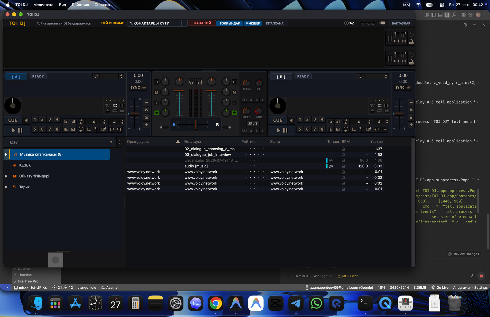

# 🎧 TOI DJ — Қазақ тойлары мен іс-шараларына арналған диджей бағдарламасы
### Professional Event & Wedding DJ Software for macOS (Apple Silicon)

  

  
  
  
  
  
  

---

## 📥 Жүктеп алу (Download TOI DJ)

macOS Apple Silicon (M1 / M2 / M3 / M4) нұсқасын тікелей жүктеп алыңыз:

| Пішім | Жүктеу сілтемесі | Өлшемі | Архитектурасы |
| :--- | :--- | :--- | :--- |
| **🍏 macOS DMG (Орнатушы)** | [**TOI-DJ-MVP-1.0.0-macOS-arm64.dmg**](https://github.com/Azamaperdeev05/toi-dj/releases/latest/download/TOI-DJ-MVP-1.0.0-macOS-arm64.dmg) | ~126 MB | Apple Silicon (`arm64`) |
| **📦 ZIP Мұрағат** | [**TOI-DJ-MVP-1.0.0-macOS-arm64.zip**](https://github.com/Azamaperdeev05/toi-dj/releases/latest/download/TOI-DJ-MVP-1.0.0-macOS-arm64.zip) | ~100 MB | Apple Silicon (`arm64`) |

> 💡 **Жүйелік талаптар:** macOS 11.0 (Big Sur), macOS 12 (Monterey), macOS 13 (Ventura), macOS 14 (Sonoma), macOS 15 (Sequoia) немесе одан жаңа Apple Silicon құрылғылары.

---

## 🎯 TOI DJ деген не?

**TOI DJ** — Қазақстандағы және ТМД елдеріндегі тойлар, мерейтойлар, құдалық, сүндет той және корпоративтік мерекелік кештерді басқаруға арналған мамандандырылған кәсіби диджей бағдарламасы.

Кәдімгі клубтық DJ бағдарламалары (VirtualDJ, Traktor, Serato) той форматына тым күрделі әрі бейімделмеген. Ал қарапайым плеерлерде (AIMP, iTunes) жедел ауыстыру, кезек, отбивкалар және екі декалы синхронды ойнату мүмкіндігі жоқ.

**TOI DJ** осы екі әлемнің ең үздік қасиеттерін біріктірді:
1. **Той сценарийіне бейімделген 12 негізгі санат (Wedding Stages)**.
2. **Асабамен (тамада) синхронды жұмыс істеуге арналған жедел отбивкалар мен CUE нүктелері**.
3. **CoreAudio қозғалтқышы арқылы 5.3 миллисекундтық кідіріссіз (ultra-low latency) таза дыбыс**.
4. **Қазақша, орысша және шетелдік әндерді лезде іздеу және саралау**.

---

## 🌟 Басты ерекшеліктері

### 1. 12 Той Кезеңі (Wedding Stages Quick Filter)
Интерфейсте әр кезең үшін арнайы сүзгіден өткен жедел плейлистер орналасқан:

| № | Кезең атауы | Мақсаты мен сипаттамасы |
| :---: | :--- | :--- |
| **1** | 🤲 **Бата** | Ақсақалдар мен қонақтар бата бергенде қойылатын сабырлы күйлер мен қасиетті фондар. |
| **2** | 👰 **Беташар** | Келін түсіру дәстүрі: дәстүрлі домбыра қағыстары, сәлем салу және заманауи беташар ырғақтары. |
| **3** | 🚪 **Кіру** | Жас жұбайлардың, мерейтой иесінің немесе құдалардың залға салтанатты кіру әуендері мен марштары. |
| **4** | 🥂 **Тост** | Құттықтау сөздердің астына жүретін нәзік, сөйлеуге кедергі келтірмейтін фондық әуендер. |
| **5** | ☕ **Фон** | Ас ішу, қонақтардың әңгімелесуі мен үзіліс кезіндегі жайлы Lounge, Jazz, Instrumental тректер. |
| **6** | 🎲 **Ойын** | Асабаның конкурстары, викториналары мен интерактивті ойындарына арналған күлкілі әрі драйвты отбивкалар. |
| **7** | 💃 **Би** | Танцполды жаратын заманауи қазақша хиттер, орысша және шетелдік ремикстер, попурри. |
| **8** | 🎂 **Торт** | Той торты кіргенде және жас жұбайлар торт кескенде ойналатын салтанатты саундтректер. |
| **9** | 💐 **Гүл** | Қалыңдықтың құрбыларына гүл лақтыру сәтіндегі қызықты әрі динамикалық әуендер. |
| **10**| 🚪 **Шығу** | Тойдың аяқталуы, қонақтармен қоштасу және естелік сәттерге арналған әндер. |
| **11**| 🎺 **Фанфар** | Жеңімпаздарды марапаттау, сыйлық тапсыру, ерекше құрмет көрсету салтанатты сигналдары. |
| **12**| 💖 **Лирика** | Жас жұбайлардың алғашқы вальсі, жұптардың баяу биі (медленный танец), махаббат лирикасы. |

---

### 2. Кәсіби екі декалы пульт
- **Deck 1 & Deck 2**: толқын пішіні (waveform), BPM анықтау, Beatmatching, теңшелетін Pitch/Speed слайдерлері.
- **Auto-DJ**: Той арасындағы үзілістерде әндерді автоматты түрде біркелкі ауыстырып отыру.
- **Crossfader & 3-Band EQ**: Төменгі (Low), ортаңғы (Mid), жоғарғы (High) жиіліктерді реттеу және Kill-батырмалары.

---

### 3. Apple Silicon (M1/M2/M3/M4) CoreAudio оңтайландыруы
- Intel эмуляциясынсыз, тікелей ARM64 нұсқауымен жұмыс істейді.
- Ноутбуктың батареясын үнемдейді, қызбайды, қатпайды.
- Жүйелік CoreAudio интеграциясы: **5.3 ms кідіріс** (Latency) — пернені немесе CUE-ді басқан сәтте дыбыс лезде шығады.

---

## ⚡ Ыстық пернелер (Keyboard Shortcuts)

Той кезінде тінтуірді (мышка) іздеп жатпай, пернетақта арқылы бәрін бір сәтте басқарыңыз:

| Батырма | Қызметі |
| :--- | :--- |
| **Space (Бос орын)** | Кітапхананы үлкейту / жинақтау режимі (Maximized Library View) |
| **Shift + ←** | Таңдалған тректі **Deck 1**-ге лезде жүктеу |
| **Shift + →** | Таңдалған тректі **Deck 2**-ге лезде жүктеу |
| **D** | **Deck 1**: Play / Pause |
| **L** | **Deck 2**: Play / Pause |
| **F** | **Deck 1**: CUE нүктесіне оралу |
| **; (нүктелі үтір)** | **Deck 2**: CUE нүктесіне оралу |
| **1, 2, 3, 4** | **Deck 1**: 1-4 жедел Hotcue нүктелері |
| **7, 8, 9, 0** | **Deck 2**: 1-4 жедел Hotcue нүктелері |
| **F1 - F12** | Той кезеңдері мен отбивкаларды лезде іске қосу |

---

## 🚀 Орнату нұсқаулығы (Installation Guide)

### 1-қадам: Жүктеп алу және орнату
1. [`TOI-DJ-MVP-1.0.0-macOS-arm64.dmg`](https://github.com/Azamaperdeev05/toi-dj/releases/latest/download/TOI-DJ-MVP-1.0.0-macOS-arm64.dmg) файлын жүктеп алыңыз.
2. DMG файлын екі рет басып ашыңыз.
3. **TOI DJ** белгішесін **Applications** қалтасына сүйреп апарыңыз.

### 2-қадам: Алғашқы рет іске қосу (macOS Gatekeeper)
Бағдарлама Apple Developer сертификатымен нотаризацияланбаған ашық бастапқы кодты болғандықтан, алғашқы рет ашқанда macOS ескерту шығаруы мүмкін. Оны ашу өте оңай:

1. **Applications (Программы)** қалтасын ашыңыз.
2. **TOI DJ** қолданбасының үстінен **Control пернесін басып тұрып басыңыз** (немесе оң жақ батырмамен / екі саусақпен басыңыз).
3. Шыққан мәзірден **Open (Открыть)** пәрменін таңдаңыз.
4. Пайда болған терезеде **Open (Открыть)** батырмасын басыңыз.
5. Бұл қадам тек **бір-ақ рет** жасалады. Одан кейін қолданба әдеттегідей екі рет басумен бірден ашылады!

---

## 🎵 Музыка қалтасын қосу

1. TOI DJ іске қосылған соң: `Preferences` (Баптаулар) -> `Library` (Кітапхана) бөліміне өтіңіз.
2. `Add` батырмасын басып, компьютеріңіздегі той музыкалары немесе Telegram арқылы жүктелген тректер қалтасын көрсетіңіз.
3. TOI DJ файлдардың BPM-ін, тоналдылығын (Key) және толқын пішінін автоматты түрде анықтайды.

---

## 🇷🇺 Описание для пользователей из СНГ / О программе

**TOI DJ** — специализированное программное обеспечение для свадебных, банкетных и ивент-диджеев, звукооператоров и ведущих. Разработано на базе движка Mixxx с глубокой адаптацией под динамику национальных и современных торжеств (бата, беташар, тосты, конкурсы, танцевальные блоки, вынос торта).

- **Нативная производительность**: скомпилировано для Apple Silicon (M1/M2/M3/M4) под macOS.
- **Минимальная задержка**: 5.3 мс CoreAudio для мгновенного запуска отбивок и эффектов.
- **12 сценарных свадебных блоков**: быстрый доступ к тематическим плейлистам в один клик.

---

## 📜 Лицензия және алғыс (License & Attribution)

- **TOI DJ** бастапқы коды [GNU General Public License v2.0 (GPLv2)](LICENSE) шартымен таратылады.
- Жоба қуатты және танымал ашық бастапқы кодты [Mixxx DJ Software](https://mixxx.org) негізінде жасалған. Барлық құқықтар мен авторлық үлестер сақталған.

---

  Жасалған жері: 🇰🇿 Қазақстан | Автор: <a href="https://github.com/Azamaperdeev05">@Azamaperdeev05</a>

